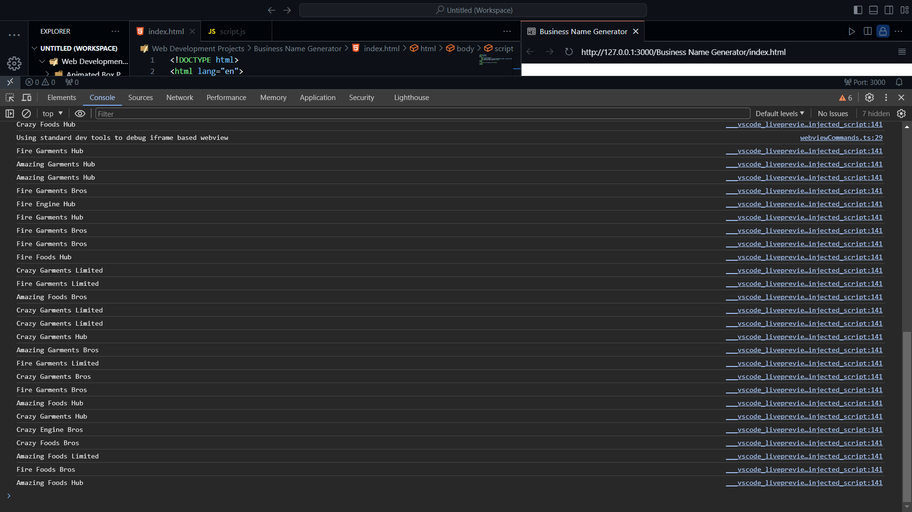

# Business Name Generator

This project is a simple business name generator. It generates a random business name each time the script is run.

## How it works

The generator creates a business name by combining three words. The first word can be "Crazy", "Amazing", or "Fire". The second word can be "Engine", "Foods", or "Garments". The third word can be "Bros", "Limited", or "Hub". The selection of each word is random.

## Screenshot

## License

This project is licensed under the MIT License.